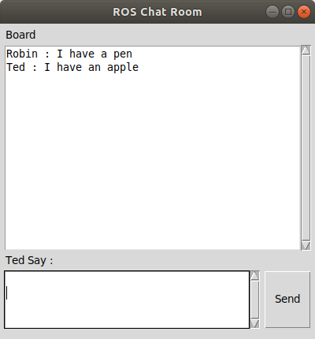

# tk_chatroom

A simple chat room practice by using ROS and Python tkinter.



The user's node use ROS service to make node /server to publish topic which is subcribed by user.


## How to Use

1. Setup ROS multi-machine env

    ```bash
    export ROS_MASTER_URI=http://<server machine IP>:11311
    export ROS_IP=<your machine IP>
    ```

2. Run

    3.1 Method 1: roslaunch

    ```bash
    roslaunch tk_chatroom main.launch name:=<your name>
    ```

    3.2 Method 2: rosrun

    ```bash
    roscore
    rosrun tk_chatroom server.py
    rosrun tk_chatroom client.py __name:=<your name>
    ```
